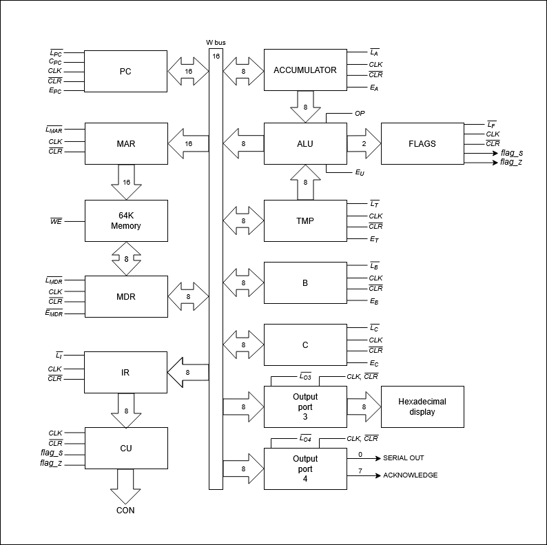
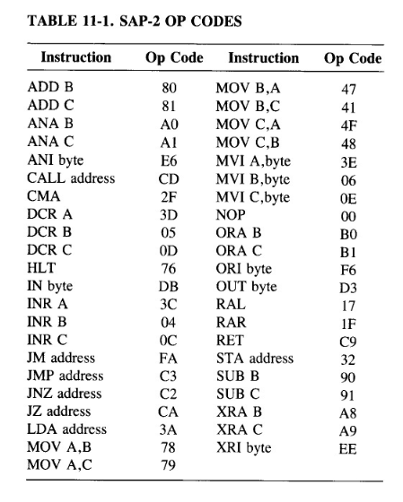
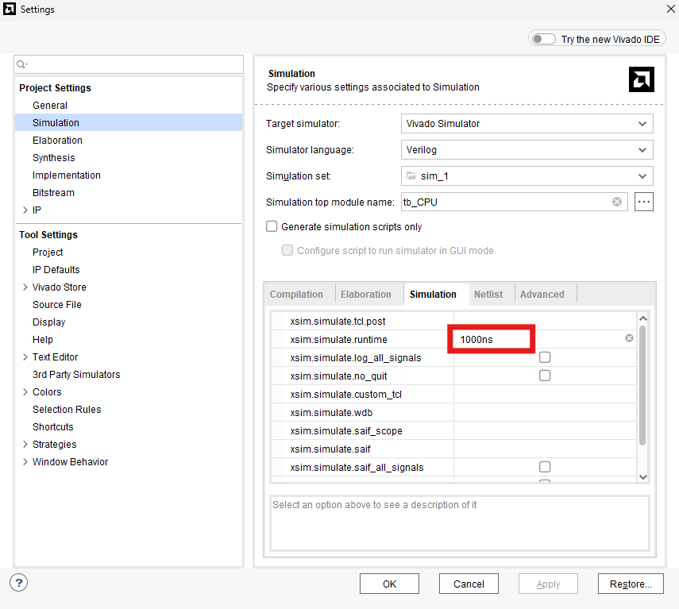
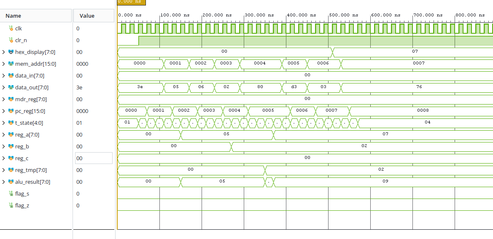

# SAP-2 Verilog

## == DIAGRAM ===




## === NOTE ===

1. INR and DCR would overwrite Accumulator so I fix it by applying a multiplexer behavior (Select / Constant 1) just like (Select / Constant 4) in Single-Bus General-Purpose Register (GPR) Architecture which used for incrementing PC. Lead to 

2. Even though active-low is not necessary anymore for this simulation, I still include it to make it looks cool 😎. Would remove in the later one for consistency and standard.

3. I use Hardwired FSM method like in ARM processor, this make the processor sends command blazing fast but it's such a pain to update the instruction set. So in the SAP-3 I'll use Microcoded ROM deisgn instead, which is standard for Intel x86 processors and IBM Mainframes.


## === INSTRUCTIONS GUIDE ===



Your simulation may not caught the running of the program till the end, so I suggest changing `xsim.simulate.runtime` from 1000ns to a higher number like 100000ns



## === TESTING ===

**Main program**

`program.mem` 
```c
// Basic Math Program

3E 05 // MVI_A, 5
06 02 // MVI_B, 2
80 // ADD B
D3 03 // OUT 3
76 // HLT
```

07 was expected as an output of the program


**All other instructions**
- [/] test_1.mem: all MOV, MVI, ADD, SUB, INR, and DCR instructions.
- [/] test_2.mem: memory access (LDA, STA), bitwise math (ANA, ORA, XRA, ANI, ORI, XRI), shifts (RAL, RAR), and inverse (CMA).
- [/] test_3.mem: conditional jumps (JZ, JNZ, JM), absolute jumps (JMP), and a subroutine (CALL, RET).